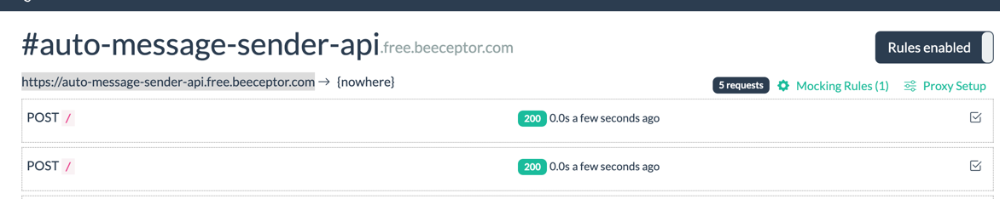
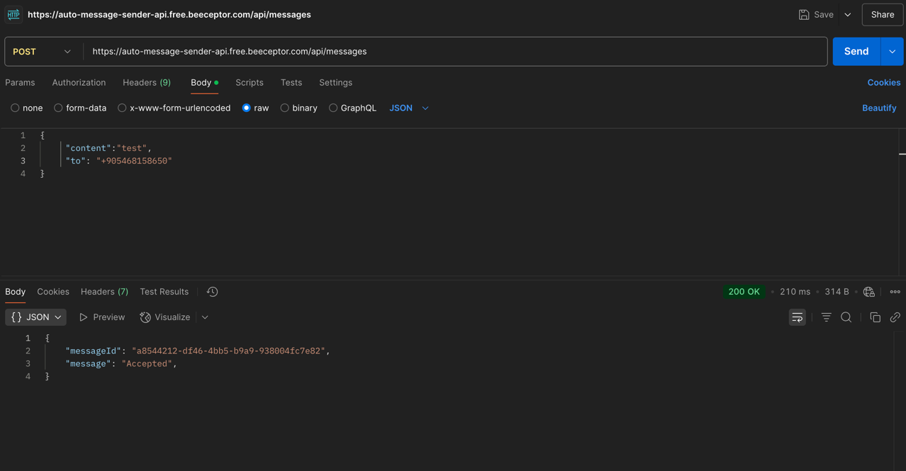
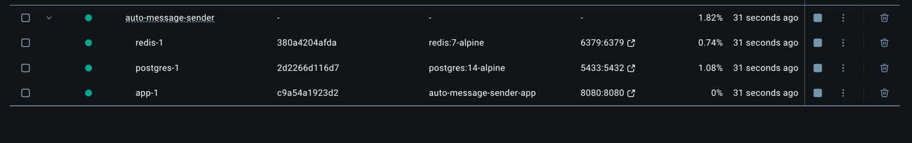

# Auto Message Sender

## Gereksinimler

- Docker
- Docker Compose

## Kurulum

1. git clone  http://github.com/tayfunuyar/auto-message-sender.git 
2. Docker Compose kullanarak uygulamayı çalıştırın:

```bash
docker compose up -d
```

## Yapılandırma

Uygulama, ortama özel yapılandırmaları desteklemektedir. İki yapılandırma dosyalar config dosyasında bulunmaktadır:

- `config/config.test.yaml`: Test ve yerel geliştirme için kullanılır (varsayılan)
- `config/config.prod.yaml`: Üretim ortamları için kullanılır

Hangi ortamın kullanılacağını belirtmek için `APP_ENV` ortam değişkenini `test` (varsayılan) veya `prod` olarak
ayarlayabilirsiniz.

Örnek:

```bash
APP_ENV=test go run cmd/api/main.go
APP_ENV=prod go run cmd/api/main.go
```

Yapılandırma dosyası yapısı aşağıdaki gibidir:

```yaml
server:
  port: 8080
  host: "0.0.0.0"

database:
  host: postgres
  port: 5432
  user: postgres
  password: postgres
  name: auto_message_sender
  ssl_mode: disable

redis:
  host: redis
  port: 6379

webhook:
  url: "https://auto-message-sender-api.free.beeceptor.com"
```

## Otomatik Mesaj Gönderimi

Servis, veritabanından 2 dakikada bir 2 adet gönderilmemiş mesajı otomatik olarak gönderir. İşlem, uygulama
dağıtıldığında otomatik olarak başlar ve API aracılığıyla açıkça durdurulana kadar devam eder.

Bir mesaj gönderildikten sonra:

1. Durumu veritabanında "gönderildi" olarak güncellenir
2. Mesaj ID'si Redis'te gönderme zamanıyla birlikte önbelleğe alınır
3. Mesaj bir daha gönderilmez

## Dokümantasyon

API dokümantasyonu için:

```
http://localhost:8080/swagger/
```

## Geliştirme

### Bağımlılıklar

- Go 1.24
- HTTP işleme için Echo framework'ü
- Veritabanı işlemleri için GORM
- PostgreSQL veritabanı
- Ayarlar için Viper
- Önbelleğe alma için Redis
- API dokümantasyonu için Swagger

### Mock Webhook API

- https://app.beeceptor.com/console/auto-message-sender-api tarafında gelen requestleri görüntüleyebilirsiniz.
- https://webhook.site/ expire olduğundan yerine beeceptor webhook kullanılmıştır. Her requestte fake messageId
  oluşturulmaktadır.

#### API Dashboard

Beeceptor Webhook API dashboard görünümü:



#### Örnek Request

Sample Request:



#### Docker Compose




